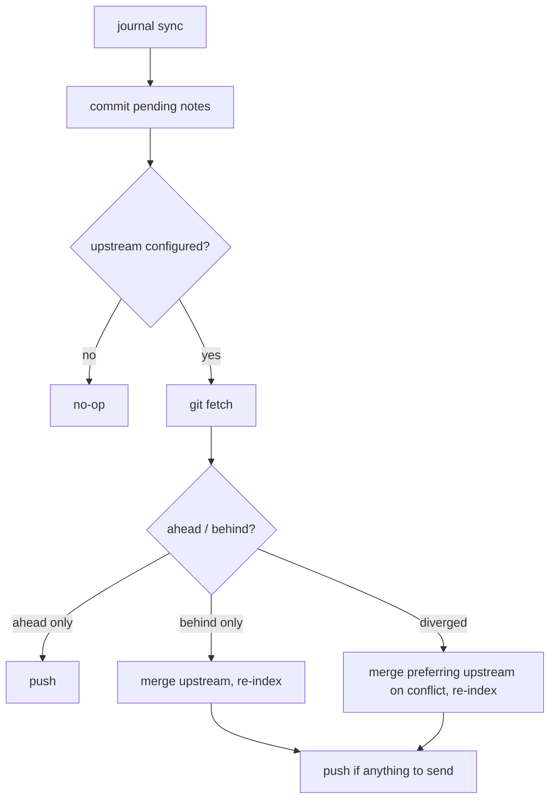

# My journal

A local-first developer journal: plain-text Markdown notes with semantic search
and AI synthesis, managed by the [`journal`](https://github.com/ericmann/journal)
CLI. Your notes live in this repo as ordinary files — `journal` just makes them
easy to capture, find, and back up.

## Layout

```
daily/         one append-only file per day — your raw notes
projects/      longer-lived, per-project notes
reflections/   AI synthesis output (excluded from indexing)
.journal/      config, the disposable search index, and sync.sh
```

## Everyday use

```sh
journal capture "shipped the sync cron; remote backup now hourly"   # add a note (auto-commits)
journal capture                       # no text: compose in your editor (like git commit)
journal capture < note.md             # or pipe the note in on stdin
journal search "how did we handle X"  # semantic search across all notes
journal recent                        # show the latest notes
journal index                         # (re)build the search index
journal index --watch                 # keep the index live as you write
journal synth weekly                  # AI synthesis of a time window
journal doctor                        # check config, models, and index health
```

Composing in the editor follows the `editor` key in `.journal/config.yaml`
(then `$JOURNAL_EDITOR`, `$VISUAL`, `$EDITOR`, then `nano`) — set e.g.
`editor: vim`. Captures and indexing auto-commit your notes locally (toggle with
`git_autocommit` in `.journal/config.yaml`). To get notes off this machine —
and pull in notes captured elsewhere — add a git remote and run `journal sync`.

## Backing up to a remote

Point the repo at a remote once:

```sh
git remote add origin git@github.com:you/journal.git
git push -u origin HEAD          # sets the upstream sync tracks
```

Then `journal sync` keeps the two in step. It commits any pending notes, then:



Preview what it would do without touching anything:

```sh
journal sync --dry-run
```

## Run it on a schedule (recommended: hourly)

`.journal/sync.sh` is a thin wrapper that finds this repo and the `journal`
binary, then runs `journal sync`. Wire it to your scheduler so backups happen
all day without you thinking about it.

### Linux & macOS — cron

Edit your crontab with `crontab -e` and add (cron runs with a minimal `PATH`, so
point `JOURNAL_BIN` at the absolute path from `which journal`):

```cron
# back up the journal every hour, on the hour
0 * * * * JOURNAL_BIN=/usr/local/bin/journal {{ROOT}}/.journal/sync.sh >> {{ROOT}}/.journal/sync.log 2>&1
```

Check it's logging with `tail -f {{ROOT}}/.journal/sync.log`.

### macOS — launchd (survives reboots, runs when awake)

cron works on macOS, but `launchd` is the native choice. Save this as
`~/Library/LaunchAgents/com.journal.sync.plist`, then
`launchctl load ~/Library/LaunchAgents/com.journal.sync.plist`:

```xml
<?xml version="1.0" encoding="UTF-8"?>
<!DOCTYPE plist PUBLIC "-//Apple//DTD PLIST 1.0//EN"
  "http://www.apple.com/DTDs/PropertyList-1.0.dtd">
<plist version="1.0">
<dict>
  <key>Label</key>            <string>com.journal.sync</string>
  <key>ProgramArguments</key> <array>
    <string>{{ROOT}}/.journal/sync.sh</string>
  </array>
  <key>EnvironmentVariables</key>
  <dict>
    <key>JOURNAL_BIN</key>    <string>/usr/local/bin/journal</string>
  </dict>
  <key>StartInterval</key>    <integer>3600</integer>
  <key>StandardOutPath</key>  <string>{{ROOT}}/.journal/sync.log</string>
  <key>StandardErrorPath</key><string>{{ROOT}}/.journal/sync.log</string>
</dict>
</plist>
```

Unload it later with
`launchctl unload ~/Library/LaunchAgents/com.journal.sync.plist`.

---

`journal init` regenerates `.journal/sync.sh` and this file, so re-running it
after upgrading the CLI is safe — it never touches your `config.yaml` or notes.
