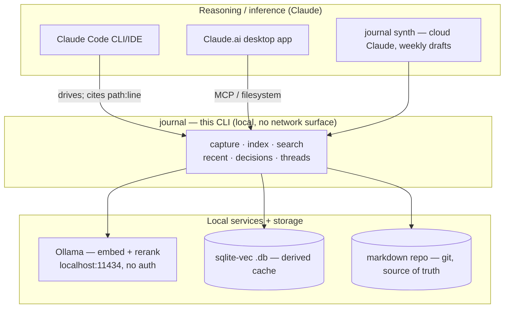

# Integrations: Claude Code, Claude desktop, and Ollama

`journal` is built as a **local retrieval substrate** that a reasoning layer
(Claude) drives. The division of labor:



Key idea: **retrieval is local** (Ollama embeddings + reranking over a
`sqlite-vec` index), and **inference is Claude** (Code, desktop, or the
scheduled `synth` jobs). Markdown in git is always the source of truth.

---

## 1. Ollama (local embeddings + reranking)

`journal` talks to Ollama over plain HTTP at `ollama_base_url` (default
`http://localhost:11434`); no auth, nothing leaves the machine.

```sh
# install + start Ollama (https://ollama.com), then pull the models:
ollama pull qwen3-embedding:4b     # embeddings (config: embed_model)
ollama pull qwen3-reranker         # reranking  (config: reranker)
```

Configure in `.journal/config.yaml`:

```yaml
embed_model: qwen3-embedding:4b
reranker: qwen3-reranker
ollama_base_url: http://localhost:11434
embed_dim: 1024                    # MUST match the model's output dimension
```

Verify the link before relying on it:

```sh
journal doctor          # checks Ollama reachable + both models present + index health
```

- **Embeddings** are used by `journal index` (documents) and `journal search`
  (queries, with a retrieval-instruction prefix).
- **Reranking** is used by `journal search` to reorder the vector-KNN
  candidates. Because Ollama has no dedicated rerank endpoint, journal scores
  candidates by prompting the reranker model via `/api/generate`; if that's
  unavailable, search falls back to vector-distance order (see
  [DECISIONS.md](DECISIONS.md)).
- `embed_dim` **must** equal your embed model's real output dimension. A
  mismatch surfaces as a clear error on `index`; fix `embed_dim` and
  `journal index --rebuild`.

> Ollama runs the *retrieval* models locally. It is **not** used for synthesis —
> that's cloud Claude (`journal synth`, Phase 5), which reads
> `ANTHROPIC_API_KEY` from the environment only.

---

## 2. Claude Code (the primary, first-class integration)

This is the integration `journal` is designed around. Claude Code shells out to
the subcommands and consumes their stable `--json`.

**Setup:** the repo ships a skill at `skills/journal/SKILL.md` (authored in
Phase 6). Make it discoverable by Claude Code one of these ways:

- Keep your journal repo open as a workspace — Claude Code picks up
  `skills/journal/SKILL.md` from the repo.
- Or symlink/copy it into your skills library:
  `ln -s "$PWD/skills/journal" ~/.claude/skills/journal`.

Make sure the binary is on `PATH` (`journal --help` works) so the skill can call
it.

**What the skill teaches Claude Code** (full text in `skills/journal/SKILL.md`):

- Prefer `journal search --json` over reading files by hand; never scrape prose
  output when `--json` exists.
- Read the result schema: `{ "results": [ { "path", "line_start", "line_end",
  "heading", "snippet", "score", "tags", "markers" } ] }`.
- Always cite findings back as `path:line_start-line_end` (clickable, verifiable
  against the markdown source of truth).
- Choose the right command: `search` for semantic questions, `recent` for "what
  was I doing lately", `decisions` for `@decision` history, `threads --stale`
  for neglected projects.
- Treat `{ "error": "…" }` + a non-zero exit as failure, distinct from an empty
  `{ "results": [] }`.

**Example a skill-guided agent would run:**

```sh
journal search "litellm fallback when qwen ooms" --k 5 --json
journal decisions --project canton --json
journal threads --stale --days 21 --json
```

Capture works the same way — Claude Code (or you) can record a note without any
embedding round-trip:

```sh
journal capture "decided to pin ncruces v0.21.3 for sqlite-vec #journal @decision"
```

---

## 3. Claude.ai desktop app (local app)

The desktop app does its **inference in the cloud (Claude)**; you bring
`journal` as the **local retrieval tool**. Two supported patterns, depending on
how much you want wired up:

### 3a. Filesystem / project knowledge (simplest, available now)

Because markdown is the source of truth, you can point the desktop app at the
journal repo directory (via its filesystem connector or by adding the folder to
a Project). The app can then read your daily/ and projects/ notes directly. This
gives the model your raw notes but **not** semantic ranking — good for "read my
canton notes", weaker for "find the thing about fallback routing".

Keep the disposable index out of scope: only the markdown matters here
(`.journal/index/` is gitignored and irrelevant to the app).

### 3b. Built-in MCP server: `journal mcp` (recommended for retrieval)

The desktop app speaks **MCP** (Model Context Protocol), and `journal` ships a
**first-party MCP server** over stdio: `journal mcp`. It gives the app the *same
high-precision retrieval* Claude Code gets, exposing these tools (each returns
the same stable JSON as the CLI's `--json`):

| MCP tool    | Arguments                                  | Returns                         |
|-------------|--------------------------------------------|---------------------------------|
| `search`    | `query`, `k?`, `tag[]?`, `project?`, `since?` | `{results:[…]}` (path:line cites) |
| `recent`    | `tag[]?`, `project?`, `since?`             | `{results:[…]}`                 |
| `decisions` | `project?`, `since?`                       | `{results:[…]}` (@decision only)|
| `threads`   | `stale?`, `days?`                          | `{threads:[…]}`                 |
| `capture`   | `text`, `tags[]?`, `project?`, `marker?`   | `{"captured":"<path>"}`         |

Register it in the desktop app's MCP config (`claude_desktop_config.json`).
Point `command` at the `journal` binary and use `--repo` (or the working
directory) to bind it to a specific journal repo:

```jsonc
{
  "mcpServers": {
    "journal": {
      "command": "/usr/local/bin/journal",
      "args": ["mcp", "--repo", "/Users/you/journal"]
    }
  }
}
```

That's it — restart the desktop app and the `journal` tools appear. Search still
uses the local Ollama configured in that repo; `capture` appends append-only.
Tool errors come back as `{"error":"…"}` (e.g. if Ollama is down), so the model
can tell failure from an empty result set.

> Verified end-to-end over the real JSON-RPC stdio handshake (initialize →
> tools/list → tools/call). Built on the official `modelcontextprotocol/go-sdk`.

### Inference, locally vs. cloud

- The **desktop app and Claude Code reason with cloud Claude.** `journal`’s
  local Ollama is only for embeddings/reranking, not generation.
- If you want **fully local inference** too, that's outside journal's scope: you
  can point other local clients at the same Ollama instance, but journal's
  synthesis (`synth`) deliberately uses cloud Claude for long-context reasoning
  quality (Phase 5), reading `ANTHROPIC_API_KEY` from the env only.

---

## Workspace separation (personal vs. A8c)

The whole pattern clones to a second workspace by copying a repo and swapping a
config + env token (validated in Phase 6):

- Separate repo → separate gitignored `.journal/index/` (its own embeddings).
- Separate `ANTHROPIC_API_KEY` in the env that launches the tool (A8c Enterprise
  token vs. personal). journal never stores the key; which repo you're in and
  which env is loaded determines the workspace.
- Ollama is shared and local — no per-workspace state there.
