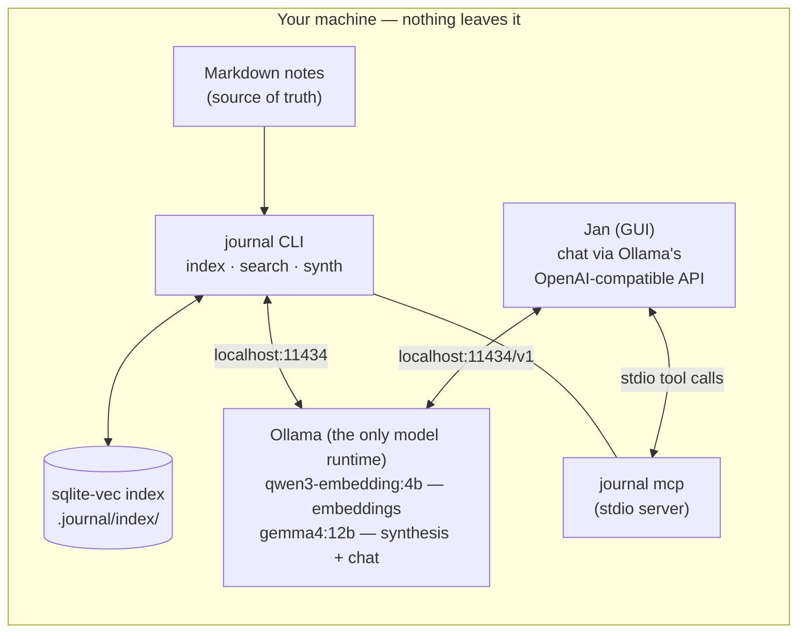

# Fully local setup guide

End-to-end recipe for running journal with **zero cloud egress**: Ollama for
embeddings and synthesis, the `local_only` kill-switch, and a local-model MCP
chat client in place of Claude Desktop. Verified June 2026.

The primary path here uses **one model runtime for everything**: Ollama serves
journal's embeddings and synthesis *and* the chat GUI (Jan), so a single loaded
model does triple duty and your RAM is spent once. LM Studio — a more polished
client that unavoidably runs a second engine — is the alternative at the end.

Companion pages: [DATA-FLOWS.md](DATA-FLOWS.md) (what leaves the machine and
when), [CLIENTS.md](CLIENTS.md) (the full client survey),
[SYNTHESIS.md](SYNTHESIS.md) (provider details and model guidance).

## The stack you're building



## 0. Hardware expectations

| Machine RAM | Embedding | Synthesis + chat model (shared) |
| --- | --- | --- |
| 16 GB | qwen3-embedding:4b (~2.5 GB) | `llama3.1:8b` (~5 GB) |
| 32-48 GB | same | `gemma4:12b` (~8-10 GB) — the default |
| 64 GB+ | same | `gemma4:26b` (MoE, ~20-24 GB peak) |

Because chat and synthesis share one Ollama model, the worst-case resident set
on the default tier is ~12 GB (embedding + gemma4:12b) — and only while in use:
Ollama loads on first call and unloads after ~5 minutes idle, so this is a
transient peak, not a standing cost.

## 1. Install and start Ollama

```sh
brew install ollama          # or download from https://ollama.com
brew services start ollama   # background service on localhost:11434
ollama --version
```

Linux: `curl -fsSL https://ollama.com/install.sh | sh` (installs a systemd
service). Keep the default bind address — journal's `local_only` mode requires
Ollama on loopback, and exposing Ollama to the network is exactly the egress
the mode exists to prevent.

## 2. Pull the models

```sh
ollama pull qwen3-embedding:4b   # required: embeddings (2.5 GB)
ollama pull gemma4:12b           # synthesis + search answers + chat (~8 GB)
```

`gemma4:12b` is the configured default — strong faithful summarization, solid
tool calling for the chat client, comfortable on a 32-48 GB machine. Step up to
`gemma4:26b` (64 GB machines) or down to `llama3.1:8b` (minimal footprint);
whichever you pull, set it in config below and pick the same one in Jan.

## 3. Configure journal

In your journal repo's `.journal/config.yaml`:

```yaml
synth_provider: ollama           # synthesis + search answers run locally
synth_ollama_model: gemma4:12b   # whatever you pulled in step 2

local_only: true                 # hard-disable every cloud path
local_only_mcp: allow            # MCP stays available for the LOCAL client below
```

`local_only: true` refuses cloud synthesis and requires loopback Ollama. (It
does *not* disable `journal sync` — backing up to your own git remote isn't
cloud-AI egress; keep `sync_enabled: false` if you want nothing to leave at
all.) `local_only_mcp: allow` is your attestation that the
MCP client you're about to configure runs a local model — the server can't
verify that itself ([DATA-FLOWS.md](DATA-FLOWS.md) explains the trust model).
Leave it as `block` (the default) until the client is actually set up.

Then verify and build the index:

```sh
journal doctor    # expect: egress check reporting the local_only posture,
                  # embed_model + synth_ollama_model both present
journal index
```

Try it:

```sh
journal synth daily              # dry run: prints the prompt, calls nothing
journal synth daily --write      # generates locally, writes reflections/daily-*.md
journal search "what did I decide about the FDE queue"   # grounded answer, local
```

## 4. Jan as the MCP chat client (over Ollama)

[Jan](https://jan.ai) is open-source (AGPL), and crucially can chat through
Ollama instead of running its own engine — that's what keeps this a
one-runtime stack.

1. **Install:** `brew install --cask jan` or https://jan.ai (macOS/Windows/Linux).
2. **Point it at Ollama:** Settings → Model Providers → add an OpenAI-compatible
   provider with base URL `http://localhost:11434/v1` (no API key). Your pulled
   Ollama models appear as choices; pick `gemma4:12b`.
3. **Enable tool calling for that model** — a per-model capability toggle in
   Jan's model settings. **Nothing works until this is on**, and it's the
   single most-missed step.
4. **Add the journal MCP server:** Settings → MCP Servers → `+`:
   - command: `/opt/homebrew/bin/journal` (absolute path — GUI apps inherit a
     minimal `PATH`, the same gotcha as Claude Desktop)
   - arguments: `mcp --repo /Users/you/journal`
5. **Use it:** start a chat and ask something that needs your notes — e.g.
   *"search my journal for open questions on the canton project and summarize
   them."* Jan shows inline approval cards per tool call (or pre-approve with
   "Allow All").

> **"Generation Failed: Forbidden"?** Ollama 403s requests whose `Origin`
> header isn't on its allowlist, and some Jan builds send Tauri's
> `http://tauri.localhost` form, which isn't in Ollama's defaults (Jan's
> maintainers recommend allowlisting both forms —
> [janhq/jan#7485](https://github.com/janhq/jan/issues/7485)). The fix appends
> to Ollama's defaults, it never replaces them:
>
> The one-liner below fixes the running session; the LaunchAgent after it makes
> it permanent. `OLLAMA_ORIGINS` **appends** to Ollama's defaults, never
> replaces them.
>
> ```sh
> # Fix the current session, then restart Ollama:
> launchctl setenv OLLAMA_ORIGINS "http://tauri.localhost,https://tauri.localhost"
> ```
>
> `launchctl setenv` does **not** survive a reboot. Install a login LaunchAgent
> so it's set once and forgotten — it re-applies the origin at every login and
> restarts Ollama only if it's already running:
>
> ```sh
> mkdir -p ~/Library/LaunchAgents
> cat > ~/Library/LaunchAgents/com.example.ollama-origins.plist <<'PLIST'
> <?xml version="1.0" encoding="UTF-8"?>
> <!DOCTYPE plist PUBLIC "-//Apple//DTD PLIST 1.0//EN" "http://www.apple.com/DTDs/PropertyList-1.0.dtd">
> <plist version="1.0">
> <dict>
>     <key>Label</key>
>     <string>com.example.ollama-origins</string>
>     <key>RunAtLoad</key>
>     <true/>
>     <key>ProgramArguments</key>
>     <array>
>         <string>/bin/sh</string>
>         <string>-c</string>
>         <string>/bin/launchctl setenv OLLAMA_ORIGINS "http://tauri.localhost,https://tauri.localhost"; if /usr/bin/pgrep -x Ollama &gt;/dev/null; then /usr/bin/pkill -x Ollama; /bin/sleep 2; /usr/bin/open -a Ollama; fi</string>
>     </array>
> </dict>
> </plist>
> PLIST
> launchctl bootstrap gui/$(id -u) ~/Library/LaunchAgents/com.example.ollama-origins.plist
> ```
>
> Remove it with `launchctl bootout gui/$(id -u)/com.example.ollama-origins`
> then delete the plist. **Linux (systemd):** `systemctl edit ollama` → add
> `Environment="OLLAMA_ORIGINS=http://tauri.localhost,https://tauri.localhost"`
> (persists across reboots already). **Windows:** this 403 is guaranteed (Tauri
> always uses `http://tauri.localhost`); set the same value as a user
> environment variable via `setx`.
>
> Avoid `OLLAMA_ORIGINS="*"`, especially with Ollama's "expose to network"
> setting on — wildcard origins plus a non-loopback bind opens your Ollama to
> any browser page and any LAN device.

The full tool surface the model gets — search, show, recent, decisions,
threads, meetings, todos, done, capture — is documented in
[INTEGRATIONS.md](INTEGRATIONS.md).

## 5. Verify the posture

```sh
journal doctor
```

The `egress` line should read something like: `local_only: no cloud-AI egress
(synth local: gemma4:12b); mcp allowed by attestation (local_only_mcp: allow —
egress depends on your MCP client); sync off`. With Jan chatting through
localhost Ollama, that dependency is satisfied and nothing leaves the machine.
(If you've enabled `sync_enabled`, the line notes `sync on → your git remote` —
that's backup to your own remote, not cloud-AI egress.) Spot-check if you like:
run a search from Jan with Wi-Fi off — everything still works.

## Alternative: LM Studio (more polish, second runtime)

[LM Studio](https://lmstudio.ai) is the most polished local MCP client — the
closest Claude Desktop analog, with a per-call confirmation dialog (editable
arguments) and the identical `mcpServers` JSON notation. The trade-off:
**LM Studio cannot use Ollama or its models.** It runs its own llama.cpp/MLX
engine with its own model store, so you'd download a second copy of your chat
model and run two engines (both idle-unload, but a synthesis run while LM
Studio is loaded means both models in RAM at once).

If the UX is worth that to you:

1. Install LM Studio (v0.3.17+ for MCP), download a Gemma 4 12B Q4 GGUF in its
   Discover tab.
2. Program sidebar → Install → Edit `mcp.json`:

```json
{
  "mcpServers": {
    "journal": {
      "command": "/opt/homebrew/bin/journal",
      "args": ["mcp", "--repo", "/Users/you/journal"]
    }
  }
}
```

Everything else (journal config, doctor verification) is identical to the
primary path.

> **Could journal itself use LM Studio instead of Ollama?** Not today —
> journal's embedding/synthesis clients speak Ollama's native API. LM Studio
> does expose an OpenAI-compatible server, so an OpenAI-compat provider is a
> plausible future addition if demand shows up; for now Ollama is the one
> required runtime.
