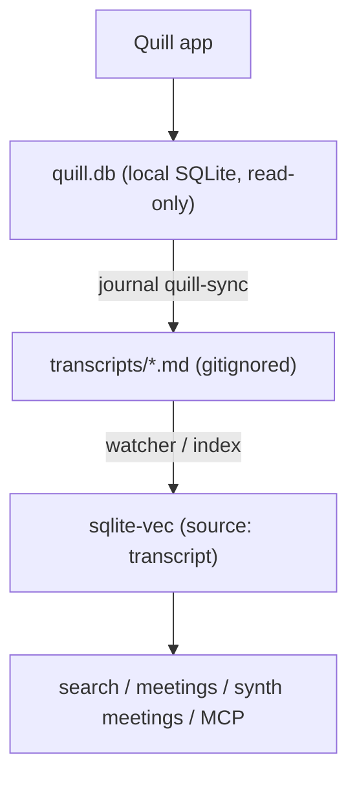

# Quill / meeting transcripts

journal can pull your [Quill](https://www.quillmeetings.com) meeting transcripts
into the search/synthesis index — fully locally. This is the headline feature of
**v2.0**.

> **Platform caveat.** The Quill app runs on **macOS and Windows only**.
> `journal quill-sync` works where Quill (and its database) is installed. On
> **Linux** there's no Quill to pull from — but the rest of the pipeline
> (transcript indexing, search, `meetings`, `synth meetings`) is cross-platform,
> and you can still feed it transcripts manually (see [.qm import](#qm-import)).

## How it works

Quill stores everything locally in a SQLite database — it does **not** export
files. So journal *pulls*: `journal quill-sync` reads that database (read-only)
and renders each meeting to Markdown in a gitignored `transcripts/` landing zone,
which the watcher/index then embed as a `transcript` source.



Transcripts are **ephemeral input**, not source of truth: `transcripts/` and the
index are gitignored and per-machine. They are **never auto-committed**.

## Setup

1. **Install Quill** (macOS/Windows) and record/import some meetings.
2. **Sync**:

   ```sh
   journal quill-sync      # renders new meetings into transcripts/
   journal index           # embed them (or let `journal index --watch` do it live)
   ```

3. **Use them**:

   ```sh
   journal search "what did we decide about pricing?" --source transcript
   journal meetings                 # recent transcripts, newest first
   journal synth meetings --write   # AI digest of the last 7 days of meetings
   ```

`journal doctor` reports whether the Quill database is found and how many
meetings are synced vs pending.

## Scheduling

Run `quill-sync` before the indexer on whatever schedule you use for the watcher
(see [SYNC.md](SYNC.md) for cron/launchd/systemd). The order each cycle is
**quill-sync → index**:

```cron
# pull new Quill meetings, then embed them, hourly
0 * * * * cd /path/to/journal && JOURNAL_BIN=/usr/local/bin/journal $JOURNAL_BIN quill-sync && $JOURNAL_BIN index
```

If `journal index --watch` is already running, you only need to schedule
`quill-sync` — the watcher embeds the freshly-written Markdown automatically.

## .qm import

Quill can also manually export a meeting as a `.qm` file (JSON whose first line
is `QMv2`). Drop one into `transcripts/` and — with `quill.accept_qm_imports:
true` (the default) — the watcher renders it to Markdown and indexes it. This is
the escape hatch on Linux, or for sharing a single meeting without the database.

## Configuration

```yaml
transcripts:
  enabled: true        # gate the whole feature
  path: transcripts    # the gitignored landing zone (repo-relative)
  format: auto         # auto | markdown | txt
  auto_index: true     # embed new transcripts as the watcher sees them
  tag: meeting         # tag applied to every transcript chunk
  log_captures: false  # append a daily breadcrumb when a transcript is indexed
quill:
  enabled: true
  db_path: ~/Library/Application Support/Quill/quill.db   # macOS default; Windows: ~/AppData/Roaming/Quill/quill.db
  accept_qm_imports: true
```

Set `transcripts.enabled: false` (or `quill.enabled: false`) to turn the feature
off entirely. See [CONFIGURATION.md](CONFIGURATION.md) for the full reference.

## A note on the Quill schema

Quill's database schema is app-internal and undocumented, and the app is actively
rewriting its internals. journal reads it **read-only** (from a temp copy, never
touching the original) behind a single adapter (`internal/quill`), parsing
defensively and skipping anything it can't read rather than failing. If a Quill
update changes the schema and sync stops finding meetings, that adapter is the
one place to fix — and `journal doctor` will still report the database as present.
