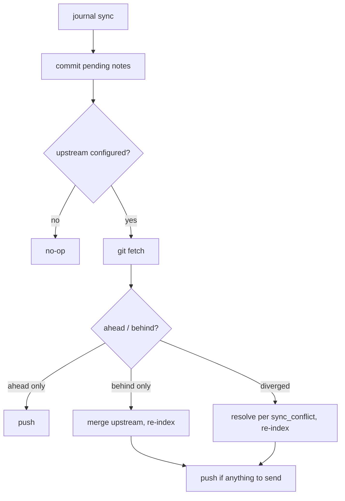

# Remote backup (`journal sync`)

`journal` auto-commits your notes locally (see "Auto-commit" in the README), so
they're safe on disk and in git history. `journal sync` is the next step: it
gets those commits **off the machine** to a git remote, and pulls in notes you
captured elsewhere.

> **`sync` is off by default.** It pushes to and pulls from a remote and can
> rewrite local history on a divergence, so it is strictly opt-in. Nothing
> happens until you set `sync_enabled: true`.

## What it does

When enabled, each run:

1. commits any pending note changes (so the backup is complete),
2. fetches the upstream, then reconciles the current branch with it:



A failed re-index (e.g. Ollama down) is non-fatal — the backup still completes;
re-run `journal index` later. With no upstream configured, `sync` is a no-op.

## Enabling it

1. Point the repo at a remote and set an upstream:

   ```sh
   git remote add origin git@github.com:you/your-journal.git
   git push -u origin HEAD
   ```

2. Enable sync in `.journal/config.yaml`:

   ```yaml
   sync_enabled: true
   sync_conflict: manual        # see below
   ```

3. Preview before trusting it to a cron:

   ```sh
   journal sync --dry-run       # reports ahead/behind and the planned action
   journal sync                 # do it for real
   ```

## Conflict handling (`sync_conflict`)

A **divergence** means both your local clone and the remote have new commits
since they last agreed. How `sync` resolves it is up to you:

| Mode | Behavior on a conflicting divergence | Use when |
| --- | --- | --- |
| `manual` *(default)* | Aborts the merge cleanly and tells you to resolve it by hand (`git pull`). **Never discards work.** | You edit notes on more than one machine and want a human in the loop. |
| `prefer-upstream` | Takes the **remote** copy of any conflicting hunk (`git merge -X theirs`). | Single-user multi-device backup where the remote is the source of truth. |
| `prefer-local` | Keeps the **local** copy of any conflicting hunk (`git merge -X ours`). | The current machine is authoritative. |

> ⚠️ `prefer-upstream` and `prefer-local` resolve conflicts **automatically**,
> which means the losing side's conflicting edits are dropped from the merge
> result (they remain in git history, but not in the working tree). They never
> run unattended unless you opt in. A clean fast-forward or a non-conflicting
> merge always just works regardless of this setting.

## Running it on a schedule

`journal init` drops a cron wrapper at `.journal/sync.sh` (a thin script that
locates the repo and the `journal` binary, then runs `journal sync`) and a
README with copy-paste **cron** and **launchd** setup. Once `sync_enabled: true`,
wire it to an hourly job:

```cron
# back up the journal every hour, on the hour (cron has a minimal PATH)
0 * * * * JOURNAL_BIN=/usr/local/bin/journal /path/to/journal/.journal/sync.sh >> /path/to/journal/.journal/sync.log 2>&1
```

See `.journal/README.md` in your repo for the full cron and macOS `launchd`
recipes. While sync is disabled, the cron job is harmless — each run just prints
the "disabled" notice and exits.
