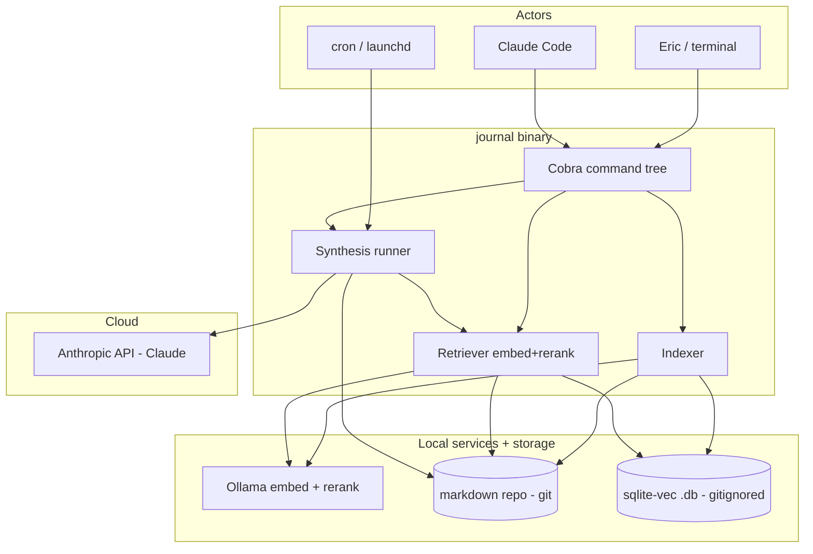
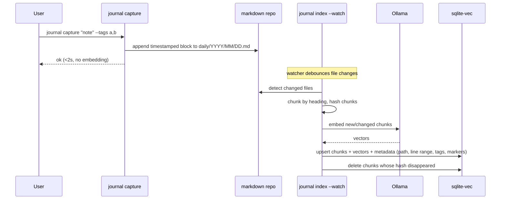
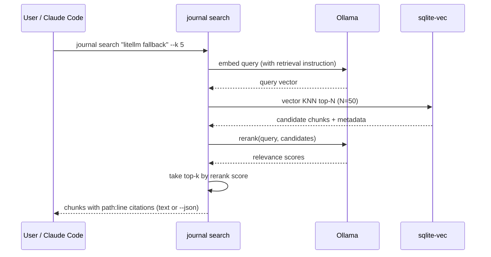
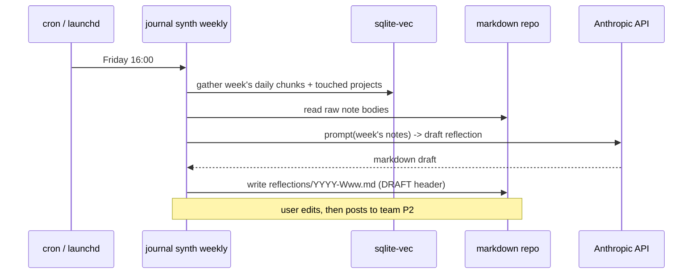

# Technical Design Document: `journal`

A local-first developer journal with semantic retrieval and AI-assisted synthesis.

| Field | Value |
|-------|-------|
| Project | `journal` |
| Author | Eric Mann |
| Date | 2026-06-01 |
| Status | Draft for build |
| Archetype | Platform TDD (adapted: local single-binary CLI, no cloud infra) |

---

## 1. Introduction

This document specifies `journal`, a single-binary command-line tool that turns a folder of plain-markdown developer notes into a searchable, AI-queryable corpus with scheduled synthesis jobs.

**Motivation.** Working notes today are scattered across loose text files, project `/docs` folders, and a physical notepad. None of it is discoverable, searchable, or reusable. Prior tooling experiments — Koan (team OKR reflections, good for broadcast), Capsule (CrowdFavorite; requires a central server, useless solo), and ad-hoc P2s (curated broadcast, hostile to a firehose dev journal) — each solved a different problem than zero-friction private capture with strong retrieval. The goal is one durable substrate (markdown in git) with a thin tool layer that makes capture frictionless and retrieval excellent.

**Scope — included:**
- A Go CLI for capture, indexing, semantic search, and structured queries over markdown notes.
- A local RAG layer: embeddings + reranking served by Ollama, vectors stored in `sqlite-vec`.
- Scheduled synthesis jobs (weekly reflection draft, decision rollup, stale-thread detection) backed by cloud Claude.
- A `SKILL.md` teaching Claude Code when to shell out to each subcommand.
- A pattern that clones cleanly to a second, isolated workspace (Displace) with separate repo + index.

**Scope — explicitly excluded:**
- Any server, daemon-with-network-surface, or multi-user/team-sharing functionality.
- Web UI beyond an *optional* localhost capture box (deferred; see Open Questions).
- Cloud-hosted vector stores, hosted embeddings, or any managed infrastructure.
- Sync/replication between machines beyond what plain git already provides.

**Related context.** Runs alongside the existing Claude Code + skills-library workflow. Embedding/reranking runs locally on an M-series MacBook Pro (48 GB unified memory) via Ollama — deliberately *not* on the Cabot/DGX box, which is reserved for other workloads.

---

## 2. Context

### Current State
- Notes in loose `.txt`/`.md` files, per-project `/docs`, and paper. No index, no search, no cross-project view.
- Capture friction is the binding constraint: anything requiring ceremony doesn't get written down.
- Two distinct needs that prior tools conflated: **broadcast** (curated, team-visible — well served by a P2) and **capture+retrieval** (messy, private, searchable — unserved).

### Target State
- A `journal/` git repo is the single source of truth: plain markdown, diffable, mergeable, tool-agnostic.
- `journal capture` appends timestamped, tagged notes in <2s with zero context switch.
- `journal search "..."` returns the handful of relevant past notes with file/line citations via embed → vector search → rerank.
- Structured queries (`decisions`, `recent`, `threads --stale`) run as plain SQL over indexed metadata.
- Friday: a synthesis job drafts a curated weekly reflection from the week's raw capture — the input you edit and post to the team P2. Capture feeds broadcast without double-entry.
- The whole thing is a single static binary on PATH on both the Thelio and the MacBook.

### Human Actors
- **Primary user (1, solo)**: captures notes throughout the day, searches past notes, reviews synthesis output. Needs near-zero capture friction and high-precision retrieval.
- **Claude Code (agent)**: shells out to `journal` subcommands to answer questions over the corpus and run synthesis. Needs stable, scriptable, JSON-emitting commands.

### System Interactions
- **Ollama** (`http://localhost:11434`): embeddings (`/api/embed`) and reranking. Local HTTP, no auth.
- **Anthropic API** (cloud Claude, a work Enterprise token): heavier synthesis reasoning. Invoked by synthesis jobs only, never by capture/search.
- **git / GitHub** (personal account): version control of the markdown source of truth. The tool does not call git itself; the user commits.
- **cron / launchd**: triggers scheduled synthesis jobs.

---

## 3. Architectural Diagrams

### Context Diagram



### Capture + Index Flow



### Search Flow



### Synthesis Flow



---

## 4. Non-Functional Requirements

Cloud-infra subsections from the platform template (Availability SLA, multi-AZ scaling, blue-green deploy, network alarms) are **N/A** for a local single-binary CLI and are intentionally omitted. The applicable subsections:

### Performance
- `journal capture` returns in **< 2s wall-clock**, doing **no** embedding inline (append-only write, then return).
- `journal search` returns in **< 5s** for a corpus up to ~10k chunks on the target hardware, including embed + KNN + rerank.
- Indexing is incremental: only chunks whose content hash changed are re-embedded. A no-op reindex over an unchanged repo completes in **< 2s**.

### Scalability
- Design target: single user, up to ~25k chunks (years of daily notes). `sqlite-vec` brute-force KNN is acceptable at this scale; no ANN index required initially.
- ⚠️ ASSUMPTION: chunk count stays under ~50k for the foreseeable life of the tool. If exceeded, revisit with an ANN index — out of scope now.

### Durability & Data Integrity
- **Markdown is the source of truth.** The `.db` is a derived, disposable cache; it is gitignored and fully rebuildable via `journal index --rebuild`.
- Capture is append-only; the tool never rewrites or deletes user note bodies. (Synthesis writes only to `reflections/` and to clearly-marked rollup blocks in project `_index.md`.)
- Chunk identity = stable hash of (file path + heading anchor + normalized body). Re-embedding is idempotent.
- No encryption at rest by the tool (notes are plaintext in a private repo on an encrypted disk; FileVault assumed).

### Configuration & Secrets
- Config lives in `.journal/config.yaml` (committed) for non-secret settings: model names, chunk strategy, exclude globs, store path, Ollama base URL.
- **Secrets** (`ANTHROPIC_API_KEY`) come from the environment only — never written to config or committed. The work Enterprise token is used for work-workspace synthesis; a personal key for personal work. The tool reads whatever is in the env at invocation; workspace separation is enforced by which repo you're in and which env is loaded, not by the tool.

### Testability
- Unit coverage target **80%+** on pure logic: chunking, hashing, citation formatting, SQL query building, config parsing.
- Ollama and Anthropic clients sit behind interfaces; tests use fakes. No network in unit tests.
- Integration tests: a `--store :memory:` (or temp-file) sqlite-vec DB and a fake embedder that returns deterministic vectors, asserting end-to-end capture → index → search.
- A golden-file test for synthesis prompt assembly (assert the assembled prompt, not the model output).

### Technical Debt
- **Addressed:** scattered, unsearchable notes; capture friction; no cross-project recall.
- **Acceptable new debt:** brute-force KNN (no ANN); no localhost capture UI in v1; reranker called per-query with no caching; single-machine assumption (git is the only "sync").

### Observability
- `--json` on every read command for scriptability and for Claude Code consumption.
- `journal doctor`: checks Ollama reachability, model availability, DB schema version, repo/config sanity; exits non-zero with actionable messages.
- Structured logs to stderr at `--log-level`; default quiet. Synthesis jobs log a one-line run summary (chunks read, tokens, output path).

---

## 5. Logical Overview

### Repository Layout

```
journal/
├── daily/
│   └── 2026/06/2026-06-01.md      # the firehose: timestamped blocks
├── projects/
│   └── <slug>/
│       ├── _index.md              # long-lived state + decision log (light frontmatter)
│       └── notes/                 # accreting notes for the thread
├── reflections/                   # synthesis OUTPUT only (curated weekly)
│   └── 2026-W23.md
├── .journal/
│   ├── config.yaml                # committed: models, chunking, excludes
│   └── index/journal.db           # gitignored: sqlite-vec store (rebuildable)
├── .gitignore                     # ignores .journal/index/
└── skills/journal/SKILL.md        # teaches Claude Code the command surface
```

### Capture Conventions

**Daily file** — minimal, no per-block frontmatter:

```markdown
# 2026-06-01

## 09:14 #cabot #litellm
Routing fallback isn't triggering when Qwen OOMs — errors instead of
falling through to cloud. Health check passes before the model loads.

## 14:02 #displace #canton @decision
Declaring the dev fund payment through Displace as business income
regardless of advice to the contrary. Rationale in projects/canton/.
```

- `#tag` → faceted retrieval (indexed as metadata).
- `@decision` / `@question` / `@todo` → structured markers the synthesis + query layers key off.
- Heading blocks (`##`) are the chunk unit.

**Project `_index.md`** — light frontmatter for state queries:

```markdown
---
status: active        # active | parked | done
last_touched: 2026-06-01
tags: [canton, displace]
---
# Canton conflict-of-interest tracking
...
```

### Core Components

| Component | Purpose |
|-----------|---------|
| `cmd/` | Cobra command tree (one file per command) |
| `internal/store` | sqlite-vec schema, migrations, upsert/query |
| `internal/index` | file walk, markdown chunking, content hashing, watch loop |
| `internal/embed` | Ollama embed + rerank client (interface + HTTP impl + fake) |
| `internal/synth` | synthesis runners; Anthropic client; prompt assembly |
| `internal/config` | load/validate `.journal/config.yaml`, resolve repo root |
| `internal/note` | parse/append daily + project markdown, marker extraction |

### Architecture Decisions

| Decision | Choice | Rationale |
|----------|--------|-----------|
| Language | Go | Single static binary, no venv/runtime; cross-compiles to NUCs; SQLite + HTTP are Go's wheelhouse. ML is over the Ollama HTTP boundary, so Python's ecosystem edge doesn't apply. |
| Source of truth | Plain markdown in git | Durable, diffable, tool-agnostic, survives any tool change. |
| Vector store | `sqlite-vec`, single `.db`, **gitignored** | One file, zero server. Index is derived/disposable; markdown is canonical. Gitignored to avoid binary-blob diffs and merge conflicts. |
| Metadata queries | Plain SQL in the same `.db` | `decisions`/`recent`/`threads` are `WHERE` clauses; no second system. |
| Embeddings | `qwen3-embedding` (4B default, 8B optional) via Ollama | Top-tier MTEB retrieval; 4B is ample for short journal chunks on 48 GB; supports retrieval instructions + flexible dims. |
| Reranking | `qwen3-reranker` via Ollama | Same family; cheap, high-leverage precision lift when notes share vocabulary. |
| Heavy reasoning | Cloud Claude (Anthropic API) | Synthesis needs strong long-context reasoning; runs scheduled, not in the hot path; respects work/personal token separation via env. |
| CLI framework | Cobra | Standard Go command tree; subcommands map cleanly to the SKILL surface. |

---

## 6. Software Architecture

### Command Surface

```
journal capture <text> [--tags a,b] [--project slug] [--marker decision|question|todo]
journal index   [--watch] [--rebuild] [--since <dur>]
journal search  <query> [--k 5] [--tag t] [--project slug] [--since 2w] [--json]
journal recent  [--tag t] [--project slug] [--since 1w] [--json]
journal decisions [--project slug] [--since 4w] [--json]
journal threads [--stale] [--days 14] [--json]
journal synth   weekly|decisions|stale [--dry-run] [--write]
journal doctor
```

- Every read command supports `--json`: a stable schema (`{results: [{path, line_start, line_end, heading, snippet, score, tags, markers}]}`) so Claude Code parses structured output, never scrapes prose.
- `capture` does the append and returns; it does **not** embed inline.
- `index --watch` is the long-running indexer (run it in a tmux pane or as a user service); `index` (one-shot) and `index --rebuild` cover manual/CI reindex.

### Ollama Client (interface-first)

```go
type Embedder interface {
    Embed(ctx context.Context, texts []string, instruction string) ([][]float32, error)
    Rerank(ctx context.Context, query string, docs []string) ([]float32, error)
}
```

- HTTP impl targets `config.OllamaBaseURL` (`/api/embed`; rerank as a score call).
- A `fakeEmbedder` returns deterministic vectors for tests (e.g. hash-seeded), enabling network-free unit + integration tests.
- Embedding applies a configurable retrieval instruction prefix; reranker scores (query, doc) pairs over the top-N KNN candidates.

### Storage Schema (sqlite-vec)

```sql
-- schema_version pragma for migrations
CREATE TABLE chunks (
    id          TEXT PRIMARY KEY,   -- stable hash(path|anchor|body)
    path        TEXT NOT NULL,
    line_start  INTEGER NOT NULL,
    line_end    INTEGER NOT NULL,
    heading     TEXT,
    body        TEXT NOT NULL,
    project     TEXT,
    created_at  TEXT,               -- parsed from daily date + block time
    indexed_at  TEXT NOT NULL
);
CREATE TABLE tags    (chunk_id TEXT, tag TEXT);     -- many-to-one
CREATE TABLE markers (chunk_id TEXT, marker TEXT);  -- decision|question|todo
CREATE VIRTUAL TABLE vec_chunks USING vec0(
    chunk_id TEXT PRIMARY KEY,
    embedding float[<dim>]          -- dim from config (e.g. 1024 or truncated)
);
```

- KNN: query `vec_chunks` for top-N, join `chunks`, optionally filter by `tags`/`markers`/`project`/date, then rerank.
- Incremental index: compute current chunk-id set per file; upsert new/changed, delete chunk-ids no longer present.

### Synthesis Runner

- Assembles a prompt from gathered notes (golden-file tested), calls the Anthropic API with the env-provided key, writes output to `reflections/` (weekly) or appends a clearly-marked rollup block to project `_index.md` (decisions).
- `--dry-run` prints the assembled prompt and intended output path without calling the API or writing — important for cost control and for verifying token boundaries.
- Reads `ANTHROPIC_API_KEY` from env only. Never logs the key. Logs token counts + output path.

### Local Development
- `make build` → `./journal`; `make test` → unit + integration (fake embedder, temp DB); `make lint`.
- `journal doctor` validates a live Ollama before real indexing.
- No code-gen, no venv, no containers required to build or run.

### Error Handling
- Commands exit non-zero with a one-line actionable message on failure (Ollama down, model missing, repo not found, DB schema mismatch).
- Ollama calls: bounded retry with backoff; clear failure if Ollama is unreachable (don't silently produce empty results).
- `--json` errors emit `{"error": "..."}` so Claude Code can distinguish failure from empty results.

---

## 7. Implementation Plan

Ordered low-risk → high-risk. Each phase ships something runnable.

### Phase 1 — Capture + repo skeleton (foundation)
Repo layout, config loading, `capture` (daily + project append, marker/tag parsing), `note` package. No embeddings yet. Outcome: frictionless capture works and writes correct markdown.

### Phase 2 — Index + store
sqlite-vec schema + migrations, markdown chunking + hashing, Ollama embed client (+ fake), `index` one-shot and `--rebuild`. Outcome: corpus is embedded and stored; rebuild is idempotent.

### Phase 3 — Search + structured queries
KNN + rerank pipeline, `search`, `recent`, `decisions`, `threads`, `--json` everywhere. Outcome: retrieval is the daily-driver value.

### Phase 4 — Watch + doctor
`index --watch` (debounced file watcher), `doctor`. Outcome: index stays fresh without manual reindex.

### Phase 5 — Synthesis
Anthropic client, prompt assembly (golden-tested), `synth weekly|decisions|stale`, `--dry-run`. Outcome: weekly reflection draft + decision rollup + stale-thread surfacing.

### Phase 6 — SKILL.md + second-workspace validation
Author `skills/journal/SKILL.md`; validate the clone-to-Displace path (separate repo, separate `.db`, separate env/token). Outcome: Claude Code uses the tool well; pattern proven to generalize.

### Tickets

**Story 1: Repo + config + capture**
*Description:* scaffold Go module + Cobra; `internal/config` (find repo root, load/validate YAML, env for secrets); `internal/note` (append to `daily/YYYY/MM/DD.md`, create/append project notes, parse `#tags` and `@markers`); `journal capture`.
*Acceptance:* `journal capture "x" --tags a,b --marker decision` appends a correctly-formatted timestamped block in <2s; project capture writes under `projects/<slug>/`; unit tests cover note formatting + marker/tag parsing.

**Story 2: Store + schema + migrations**
*Description:* `internal/store` with sqlite-vec; schema above; `schema_version` migration runner; upsert/delete/query primitives.
*Acceptance:* schema creates on a fresh DB; migration runner is idempotent; CRUD + KNN covered by tests against a temp DB.

**Story 3: Chunking + hashing + embed client**
*Description:* `internal/index` markdown chunker (split on `##`, capture heading/line range), stable chunk hashing; `internal/embed` Ollama client + `fakeEmbedder`; retrieval-instruction support.
*Acceptance:* chunker emits correct line ranges; hash is stable across runs and changes only on body edits; embed client unit-tested with a stubbed HTTP server; fake embedder is deterministic.

**Story 4: Index command (one-shot + rebuild + incremental)**
*Description:* wire walk → chunk → hash → embed-changed-only → upsert/delete; `index`, `index --rebuild`, `index --since`.
*Acceptance:* first index embeds all chunks; re-index of unchanged repo is a <2s no-op (zero embed calls); editing one block re-embeds only that chunk; deleting a block removes its row.

**Story 5: Search + rerank + structured queries**
*Description:* `search` (embed query → KNN top-N → rerank → top-k with citations); `recent`/`decisions`/`threads` as SQL; `--json` schema across all read commands; metadata filters.
*Acceptance:* `search` returns path:line citations ordered by rerank score; filters apply; `--json` matches the documented schema; `decisions --project x` returns only `@decision` chunks for that project.

**Story 6: Watch + doctor**
*Description:* debounced recursive watcher honoring exclude globs; `doctor` checks (Ollama up, models present, schema version, repo/config).
*Acceptance:* editing a file triggers re-index of only that file within a few seconds; `doctor` exits non-zero with actionable text when Ollama is down or a model is missing.

**Story 7: Synthesis**
*Description:* `internal/synth` Anthropic client (env key, no logging of key); prompt assembly per job; `synth weekly|decisions|stale`; `--dry-run` and `--write`.
*Acceptance:* `synth weekly --dry-run` prints the assembled prompt + target path and makes no network call; `--write` produces `reflections/YYYY-Www.md` with a DRAFT header; prompt assembly is golden-file tested; decisions rollup appends a marked block to project `_index.md` without touching note bodies.

**Story 8: SKILL.md + Displace clone validation**
*Description:* author `skills/journal/SKILL.md` (when to call which subcommand, how to read `--json`, how to cite back path:line); document and test the second-workspace clone (separate repo, gitignored `.db`, separate env token).
*Acceptance:* a clean clone in a second directory indexes and searches independently with its own `.db`; SKILL.md instructs Claude Code to prefer `search --json` and to cite path:line; no cross-workspace contamination.

---

## 8. Monitoring & Observability

- **`journal doctor`** is the health surface: Ollama reachability + model presence, DB schema version, repo/config validity. Non-zero exit + actionable message on any failure.
- **Structured stderr logs** at `--log-level` (default quiet). Synthesis logs a one-line run summary (chunks read, prompt tokens, output path).
- **`--json`** on read commands is the machine-observability surface for Claude Code.

---

## 9. Conclusion

`journal` gives a single durable substrate (markdown in git) a thin, fast tool layer: frictionless capture, high-precision local retrieval via Ollama + sqlite-vec, and scheduled cloud-Claude synthesis that turns the private firehose into the curated weekly reflection you actually post. It is a single static Go binary with no server and no runtime, and the whole pattern clones to a second isolated workspace by copying a repo and swapping a config + env token.

**Next steps**
1. Confirm the two open questions below.
2. Hand the companion build prompt to Claude Code on the MacBook; build Phases 1–3 first (capture + index + search is the daily-driver MVP).
3. Pull `qwen3-embedding:4b` and `qwen3-reranker` in Ollama; run `journal doctor`.
4. Dogfood capture/search for a week before wiring synthesis (Phases 4–5).

**Open Questions**
- ⚠️ Embedding model default: **`qwen3-embedding:4b`** (recommended — ample for journal chunks, leaves headroom) vs `:8b` (top MTEB, heavier). Decide the config default; either is swappable.
- ⚠️ Optional localhost capture box (single text field POSTing to `journal capture`) for when not in a terminal, given you bounce between the Thelio and the MacBook. Deferred out of v1 — confirm that's acceptable.
- ⚠️ Watcher delivery: run `index --watch` in a tmux pane vs install as a launchd/systemd user service. Build supports both; pick the default you want documented in the README.